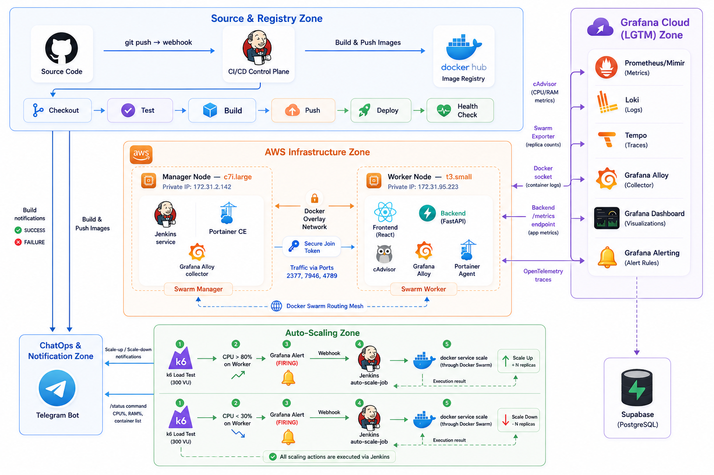

# 📌 Portfolio & GitHub Profile — Trà Đức Toàn (ductoanoxo)

   

  

  
  
  
  
  

---

## 🙋‍♂️ Giới Thiệu Bản Thân

Tôi là một kỹ sư **DevOps & Fullstack Developer** đam mê tự động hóa hạ tầng, tối ưu hóa quy trình triển khai và tích hợp các công nghệ AI tiên tiến vào ứng dụng thực tế. Với tư duy định hướng hệ thống vững chắc, tôi luôn cố gắng xây dựng các giải pháp phần mềm và hạ tầng chuẩn **production-ready**, có khả năng mở rộng tốt (scalability), độ tin cậy cao (reliability) và giám sát toàn diện (observability).

> **Phương châm làm việc:** *"If it's not automated, it's broken. If it's not observed, it's invisible."*

---

## 📌 Các Dự Án Tiêu Biểu (Featured Pinned Projects)

  
  
  

---

## 🏆 Dự Án Trọng Tâm (Core Star Project)

### 🚀 [Auto-Deploy Stack — Full-Stack DevOps on Docker Swarm](https://github.com/ductoanoxo/auto-deploy_stack)

**Auto-Deploy Stack** là hệ thống DevOps end-to-end hoàn chỉnh mà tôi thiết kế và triển khai trên hạ tầng **AWS EC2 (Docker Swarm Cluster)** để tự động hóa hoàn toàn luồng phát triển và vận hành của một ứng dụng Fullstack (React + FastAPI).

  

  
  
  
  
  

#### 🌟 Điểm Nhấn Kiến Trúc & Công Nghệ Cốt Lõi:

1. **🔄 Pipeline CI/CD Tự Động Hóa Hoàn Toàn (Jenkinsfile)**
   - Triển khai mô hình điều phối GitOps: `git push` → GitHub Webhook → Jenkins Trigger.
   - Build multi-stage Docker tối ưu dung lượng, tích hợp bộ kiểm thử tự động **Pytest**.
   - Rolling update **zero-downtime** và tự động rollback khi kiểm tra health check thất bại.

2. **📈 Hệ Thống Smart Auto-Scaling Tự Động Tải**
   - Cơ chế scale tự động dựa trên tải thực tế: **k6 Load Test (300 VU)** → **CPU Node > 80%** → **Grafana High CPU Alert (Firing)** → **Jenkins Webhook Trigger** → **Auto-Scale script** (`docker service scale frontend=3 backend=3`).
   - Tự động scale-down an toàn khi tải giảm liên tục dưới 30% để tối ưu tài nguyên AWS.

3. **🔭 Observability Stack Toàn Diện (LGTM)**
   - **Metrics & Logs**: Thu thập metrics hệ thống qua **cAdvisor**, **Swarm Exporter** và logs container qua **Grafana Alloy** đẩy trực tiếp về Grafana Cloud.
   - **Distributed Tracing**: Tích hợp **OpenTelemetry** trong FastAPI backend, chuyển traces về **Tempo** để debug hiệu năng từng API request một cách trực quan.

4. **💬 ChatOps Thông Minh Qua Telegram**
   - Tích hợp Telegram Bot thông báo kết quả build, trạng thái scale-up/down.
   - Hỗ trợ câu lệnh tương tác `/status` để quản trị viên truy vấn nhanh CPU%, RAM%, Disk% và danh sách container đang active ngay trên điện thoại.

---

## 💡 Các Dự Án AI & Công Nghệ Khác (Featured Ventures)

Bên cạnh mảng DevOps hạ tầng, tôi có kinh nghiệm chuyên sâu trong việc nghiên cứu và xây dựng các hệ thống AI ứng dụng (AI Agent & RAG) với kiến trúc Microservices hiện đại:

### 🎓 1. [AI Learning Studio — Nền Tảng AI Tạo Học Liệu Số](https://github.com/ductoanoxo/AI-FOR-EDUCATION)
*Nền tảng MVP hỗ trợ giáo dục thông minh giúp giáo viên và học sinh tạo nội dung học tập đa phương thức từ tài liệu số.*

*   **Tính năng chính:**
    *   **Advanced RAG Pipeline**: Sử dụng **Semantic Chunking** chia tài liệu theo ngữ nghĩa, kết hợp **Hybrid Search** (Chroma Vector Database + BM25 Keyword Search) và bộ tái xếp hạng **FlashRank Re-ranking** nâng độ chính xác câu trả lời lên tối đa.
    *   **AI Generator Worker**: Điều phối các tiến trình chạy nền phức tạp qua **Celery + Redis** để sinh tự động Slides thuyết trình (`.pptx`), Podcasts kịch bản đối thoại, Minigames (quizzes, flashcard), và chuyển đổi giọng nói (STT/TTS).
    *   **Interactive System**: Tích hợp **3D Mascot Assistant** tương tác qua Three.js, hỗ trợ truy cập web real-time (Tavily/SerpAPI) để tổng hợp kiến thức từ YouTube & Google.
*   **Tech Stack:** Next.js 14, FastAPI, MongoDB, ChromaDB, Redis, Celery, MinIO / Cloudflare R2, Docker.

---

### 🤖 2. [Agent SQL — Hệ Thống Đa Tác Vụ Multi-Agent NL2SQL](https://github.com/ductoanoxo/Agent_SQL)
*Hệ thống chuyển đổi ngôn ngữ tự nhiên thành truy vấn cơ sở dữ liệu và thực thi an toàn.*

*   **Tính năng chính:**
    *   **Multi-Agent Workflow**: Chia nhỏ tác vụ phân tích schema, tạo SQL tối ưu qua LLM (Gemini/GPT-4o Mini) và thực thi kiểm duyệt riêng biệt để đảm bảo an toàn dữ liệu.
    *   **Hỗ trợ đa nguồn dữ liệu**: Kết nối thông suốt 6 loại cơ sở dữ liệu: PostgreSQL (Supabase Connection Pooling), MySQL, MongoDB, Redis, SQLite và DuckDB (phục vụ OLAP phân tích tốc độ cao).
    *   **UI/UX Cao Cấp**: Dashboard trực quan hiển thị kết quả dạng bảng dữ liệu thô và biểu đồ phân tích tự động.
*   **Tech Stack:** FastAPI, Next.js, OpenRouter, Supabase, Docker Compose (Hot Reload).

---

## 🛠️ Hộp Công Cụ Công Nghệ (Tech Stack Matrix)

  

| Lĩnh vực | Các công nghệ & Công cụ làm chủ |
|---|---|
| **DevOps & Cloud** | Docker, Docker Swarm, Jenkins, AWS (EC2, VPC, S3), Nginx, Portainer, Git |
| **Observability & Testing** | Prometheus, Grafana Cloud, Loki, Tempo, Grafana Alloy, OpenTelemetry, k6, Pytest |
| **Backend & AI Engine** | Python, FastAPI, Celery, LangChain, RAG, OpenRouter, Google Gemini, OpenAI APIs |
| **Frontend Development** | Next.js, React, TailwindCSS, TypeScript, HTML5/CSS3, Three.js |
| **Databases & Cache** | Supabase, PostgreSQL, MongoDB, Redis, MySQL, SQLite, DuckDB, MinIO |

---

## 📈 Bảng Hoạt Động & Thống Kê (GitHub Activity & Stats)

  

  <table style="margin: 0 auto; border: none;">
    <tr style="border: none;">
      <td style="padding: 10px; border: none;">
        
      </td>
      <td style="padding: 10px; border: none;">
        
      </td>
    </tr>
  </table>

---

  Cảm ơn bạn đã ghé thăm trang cá nhân của tôi! Nếu bạn quan tâm đến các dự án trên, hãy thả một ⭐️ Star cho repo nhé! 

  <b>Trà Đức Toàn</b> — <i>DevOps & Software Architect</i>

  

